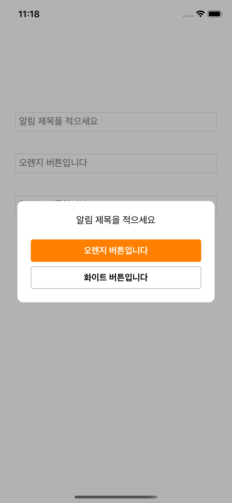

# DaangnMarket Clone

> 패스트캠퍼스에서 약 1달간(2020.03.20 ~ 2020.04.29) 진행한 Backend 수강생들과의 협업 프로젝트

## 설명

- Code UI
- Custom View
- Codable, Alamofire 사용하여 네트워크 통신을 함
- SwiftLint, Then : 코드 가독성을 높이고, 유지보수 및 협업에 도움을 줌
- SnapKit : 코드로 레이아웃 짤 때 도움 받음
- KingFisher : 이미지 캐싱에 도움 받음
- 협업 툴 : Git, Github project board / AdobeXD / Miro / Postman / Slack / Notion

## 담당 기능 구현

- 게시글 피드 및 카테고리별 목록 조회

  <p>
    
    
  </p>  

- 중고거래 글쓰기

  <p>
    
    
    
  </p>  

- 당근마켓 알림창 : 일반 알림창을 구현하는 방식처럼 갖다 쓸 수 있도록 구현

  - 일반 알림처럼 쓸 수 있도록 구현

  - `DGAlertController(title: String)`, `DGAlertController(title: String, view: UIView)`

  - `DGAlertAction(title: String, style: DGAlertAction.Style)`
    `DGAlertAction(title: String, style: DGAlertAction.Style, handler: (() -> Void)?)`

    - ```swift
      extension DGAlertAction {
        enum Style {
          case orange, white, cancel
        }
      }
      ```

    - ```swift
      private var handler: (() -> Void)?
      
      @objc func handlerAction() {
          self.superview?.parentViewController?.dismiss(animated: false) {
            self.handler?()
          }
        }
      ```

  <p>
    
    
    
  </p>

  

  <p>
  </p>

## TroubleShooting

- 1.
  - 문제 : TextView의 컨텐츠 내용에 맞춰 TableViewCell 크기가 늘어나야 함
  - 해결 : 텍스트뷰가 해당 셀에 딱 맞는 사이즈로 설정한 뒤, `beginUpdates()`, `endUpdates()` 를 사용하여 텍스트뷰에 텍스트가 입력 될 때마다 사이즈를 업데이트 해야 하는지 확인한다.

- 2.
  - 문제 : StackView에 담은 View를 삭제해야 함
  - 해결 : stackView는 View 안에 있는 이중 View이므로, 위 메서드를 사용할 경우 stackView에만 지워지고 superView에는 남아있다. `stackView.removeFromSuperView()` 로 모두 지워준다.

- 3.
  - 문제 : 카테고리 리스트를 서버에서는 영어로 저장하고, 앱에서 사용할 땐 한글로 보여줘야 함. 
  - 해결 : enum을 사용하였고, korean 함수를 사용하여 선택한 케이스를 한글로 반환하도록 했다.
  
- 4.
  - 문제 : 이미지와 텍스트를 한 번에 서버에 전송해야 함
  - 해결 : Alamofire MultipartFormData 사용하였고, parameters 타입은 `[String: Any]` 로 받는다. 전달하기 전 value가 Data 타입일 땐 다음과 같은 이미지 업로드 양식에 맞춰 전송하도록 했다. `multiFormData.append(value, withName: key, fileName: "image\(num).jpeg", mimeType: "image/jpeg")`
  
