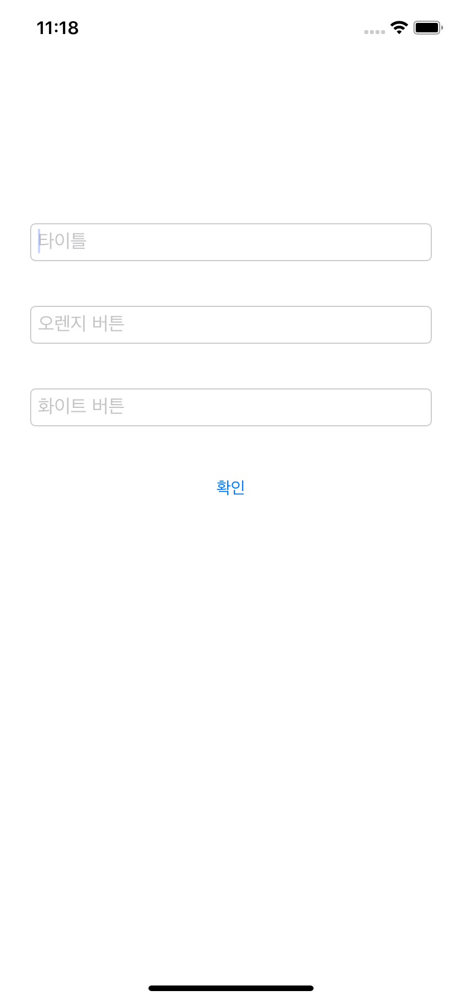

# DaangnMarket Clone

> 패스트캠퍼스에서 약 1달간(2020.03.20 ~ 2020.04.29) 진행한 Backend 수강생들과의 협업 프로젝트

## Description

- Code UI
- Custom View
- Codable
  - Encoding - query parameter
  - Decoding - JSON format response 파싱
- pagination 사용하여 데이터 양을 제한적으로 받음
- Backend 개발자와 함께 데이터 구조 고민, 설계
- Cocoapods를 통한 다양한 open source library 사용
  - SwiftLint - 코드 가독성
  - Alamofire - REST API와 통신하고 `Result<Success, Failure>` 타입을 사용한 response 처리
  - SnapKit
  - KingFisher
  - Then
  
  ### Tool
  
- Git과 Git-Flow를 사용한 프로젝트 관리 경험
  
  - CLI(iTerm2) 및 GUI(GitKraken) 사용
- AdobeXD - WireFrame 제작 기여
- Miro - Flow Chart 제작 기여
- Postman - REST API를 테스트
- Github issue와 [project board](https://github.com/orgs/FinalProject-Team4/projects/4)를 사용
- Slack의 web hook 기능을 사용하여 Github issue, pull request 등을 알림 받음
- Notion을 사용하여 커뮤니케이션 및 troubleshooting 진행


## Implementation

- 게시글 피드 및 카테고리별 목록 조회

  <p>
    
    
  </p>  

- 중고거래 글쓰기

  <p>
    
    
    
  </p>  

- 당근마켓 알림창 : 일반 알림창을 구현하는 방식처럼 갖다 쓸 수 있도록 구현

  - 일반 알림처럼 쓸 수 있도록 구현

  - `DGAlertController(title: String)`, `DGAlertController(title: String, view: UIView)`

  - `DGAlertAction(title: String, style: DGAlertAction.Style)`
    `DGAlertAction(title: String, style: DGAlertAction.Style, handler: (() -> Void)?)`

    - ```swift
      extension DGAlertAction {
        enum Style {
          case orange, white, cancel
        }
      }
      ```

    - ```swift
      private var handler: (() -> Void)?
      
      @objc func handlerAction() {
          self.superview?.parentViewController?.dismiss(animated: false) {
            self.handler?()
          }
        }
      ```

  <p>
    
    
    
  </p>

  

  <p>
  </p>

## TroubleShooting

- TextView의 컨텐츠 내용에 맞춰 TableViewCell 크기가 늘어나야 함
  ```swift
  textView.sizeToFit()
  
  extension WriteTableTitleCell: UITextViewDelegate {
    func textViewDidChange(_ textView: UITextView) {
      UIView.setAnimationsEnabled(false)
      self.tableView?.beginUpdates()
      self.tableView?.endUpdates()
      UIView.setAnimationsEnabled(true)
    }
  }
  ```
  - 텍스트뷰에 입력이 올 때마다 UI를 변경
  
- StackView에 담은 View를 삭제해야 함
  - `stackView.removeArrangeSubView()`  만으로는 원하는 결과를 낼 수 없음
  - stackView는 View 안에 있는 이중 View이므로, 위 메서드를 사용할 경우 stackView에만 지워지고 superView에는 남아있게 된다
  - `stackView.removeFromSuperView()` 로 모두 지워줘야한다.

- 카테고리 리스트를 서버에서는 영어로 저장, 앱에서는 한글로 보여야 하는 걸 한 번에 관리해야 함
  ```swift
  enum DGCategory: String, CaseIterable {
    case digital, furniture, baby, life
    case womanWear = "woman_wear"
    case womanGoods = "woman_goods"
    case beauty, male, sports, game, book, pet, other, buy
    
    var korean: String {
      switch self {
      case .digital:
        return "디지털/가전"
      case .furniture:
        return "가구/인테리어"
      case .baby:
        return "유아동/유아도서"
      case .life:
        return "생활/가공식품"
      case .womanWear:
        return "여성의류"
      case .womanGoods:
        return "여상잡화"
      case .beauty:
        return "뷰티/미용"
      case .male:
        return "남성패션/잡화"
      case .sports:
        return "스포츠/레저"
      case .game:
        return "게임/취미"
      case .book:
        return "도서/티켓/음반"
      case .pet:
        return "반려동물용품"
      case .other:
        return "기타 중고물품"
      case .buy:
        return "삽니다"
      }
    }
  }
  
  DGCategory.allCases.map { $0.rawValue }
  DGCategory.allCases.map { $0.korean }
  
  ```
  
- Alamofire MultipartFormData 사용
  ```swift
  private func request(_ parameters: [String: Any], _ headers: HTTPHeaders, completion: @escaping (Result<Post, AFError>) -> Void) {
    AF.upload(
      multipartFormData: { (multiFormData) in
        for (key, value) in parameters {
          if let data = value as? [Data] { // 이미지
            data.forEach {
              let num = data.firstIndex(of: $0)
              multiFormData.append($0, withName: key, fileName: "image\(num).jpeg", mimeType: "image/jpeg")
            }
          } else { // 그 외
            multiFormData.append("\(value)".data(using: .utf8)!, withName: key)
          }
        }
    }, to: "http://13.125.217.34/post/",
       method: .post,
       headers: headers
    )
      .validate()
      .responseDecodable { (resonse: DataResponse<Post, AFError>) in
        switch resonse.result {
        case .success(let data):
          completion(.success(data))
        case .failure(let error):
          completion(.failure(error))
        }
    }
  }
  ```
  
